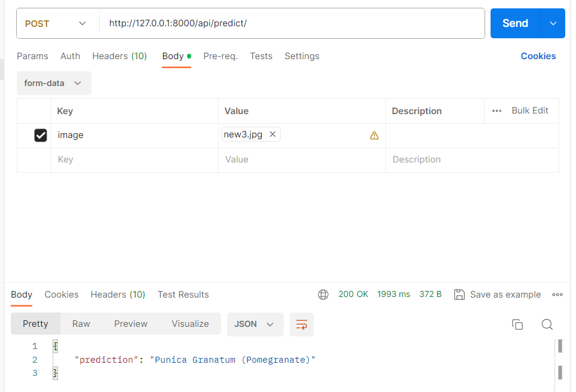

## Medicinal Plant Identification And Retrieval-Augmented Generation (RAG) Chatbot
Designed and implemented a robust backend system for an AI chatbot, integrating RAG processing and a CNN model (InceptionV3) for medicinal plant identification. Developed a seamless API service for predicting plant names and a responsive RAG Chatbot, showcasing adaptability and resourcefulness in overcoming project constraints. Utilized technologies including Django Rest Framework, Hugging Face, Tensorflow, LangChain, and OpenAI to create production-level RAG and AI systems.
- 
- Tags: Web, ML/AI
- Badges:
  - Web [red]
  - ML [blue]
- Buttons:
  - Link [https://github.com/PhaleshM/SIH_backend]

## Blog Website with ReactJS & DjangoRestFramework
This blogging website utilizes customized microservices (APIs) developed using Django Rest Framework, along with a React framework for the frontend.
- 
- Tags: Web
- Badges:
  - Web [red]
- Buttons:
  - Link [https://github.com/PhaleshM/Blog_React_Rest]

## Gesture Recognition
Trained a Convolutional Neural Network (CNN) model on a leapGestRecog dataset (20,000 images of hand gestures) from the Kaggle Hand Gesture Recognition Database, which includes nine different types of gestures. Additionally, we developed a Wrist-worn Neural Artificial Intelligence (WNAI) system using the Mediapipe Hand Landmark model as a backup to recognize hand gestures.
- 
- Tags: ML/AI
- Badges:
  - ML [blue]
- Buttons:
  - Link [https://github.com/asaxena0179/HackJEC_Segmentation-fault]

## mechoriders.com
Created a website for College Team with Payment Gateway and SMTP services. Deployed it on cPanel.
- 
- Tags: Web
- Badges:
  - Web [red]
- Buttons:
  - Link [https://github.com/PhaleshM/Cesarz]