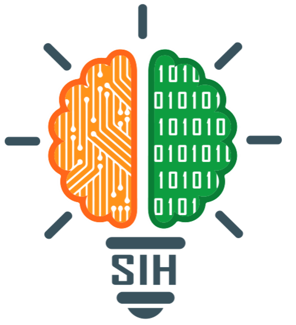
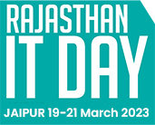

## SIH 2022
- *ML Engineer* | Mar'22 - Apr'22
- 
- Tags: Hackathons
- Badges:
  - ML [blue]
- List Items:
  - Problem Statement: To develop a solution for Gesture enabled commands for operating Laptops/PCs for frequently used operations on a daily basis.
  - Our Solution: Created a software which recognizes gestures and face with the help of Matplotlib and CNN, the new gesture could be added and gesture controls could be customized.
  - Tech Stack: Google Colab, Python , TensorFlow, Keras, Face Recognition, Matplotlib

## IT Day Hackathon 2023
- *Backend Developer* | Mar'23 - Mar'23
- 
- Tags: Hackathons
- Badges:
  - Web [red]
- List Items:
  - Problem Statment: The farmers engage in farming and living in villages do not have affordable technology and proper value of their products due to proper reach to the market.
  - Our Solution: Our team has developed an e-commerce marketplace that enables individuals with extra or unused agricultural machinery to register and make it available for rent to others.
  - Tech Stack: ReactJS, DjangoRestFramework
